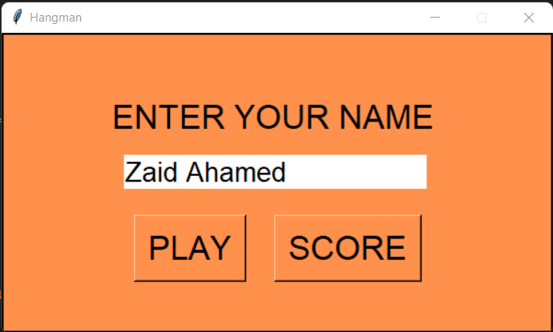

# Hangman Game

The Game is implement Using python. Used Tkinter Module to build  Attractive User-Interface  and  Used Random  Module to get random word from file. loops   and  functions  are  helped  to  efficiently  build  this  game. Text files are used for store and retrive the words and player records.    

   

