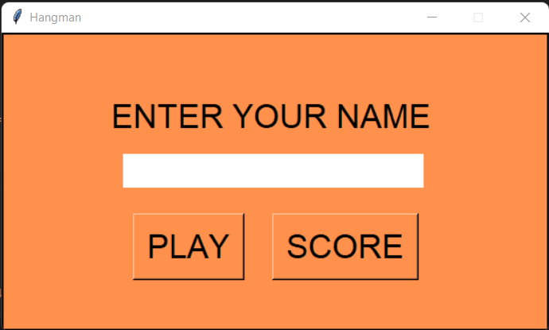
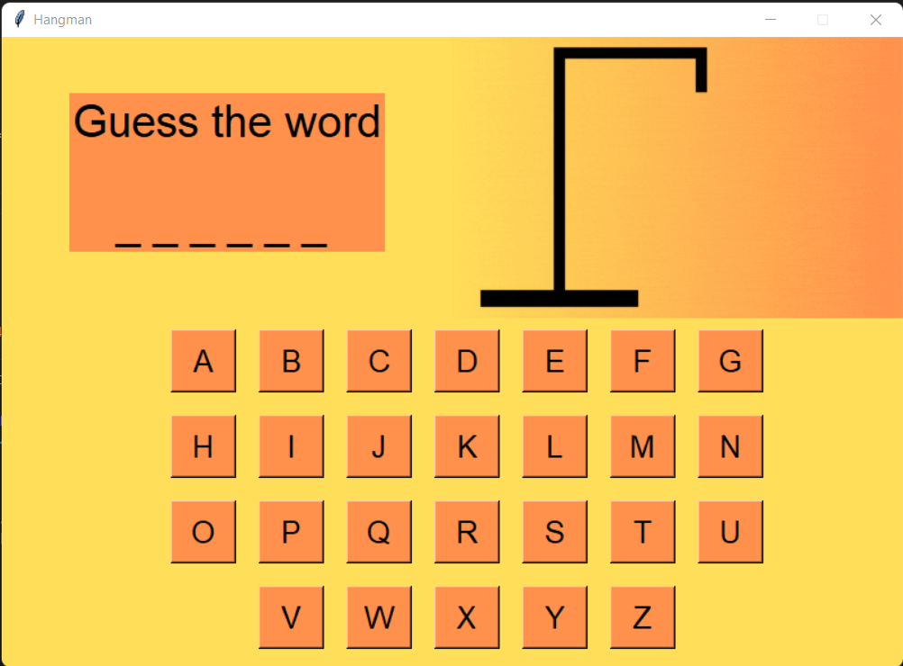
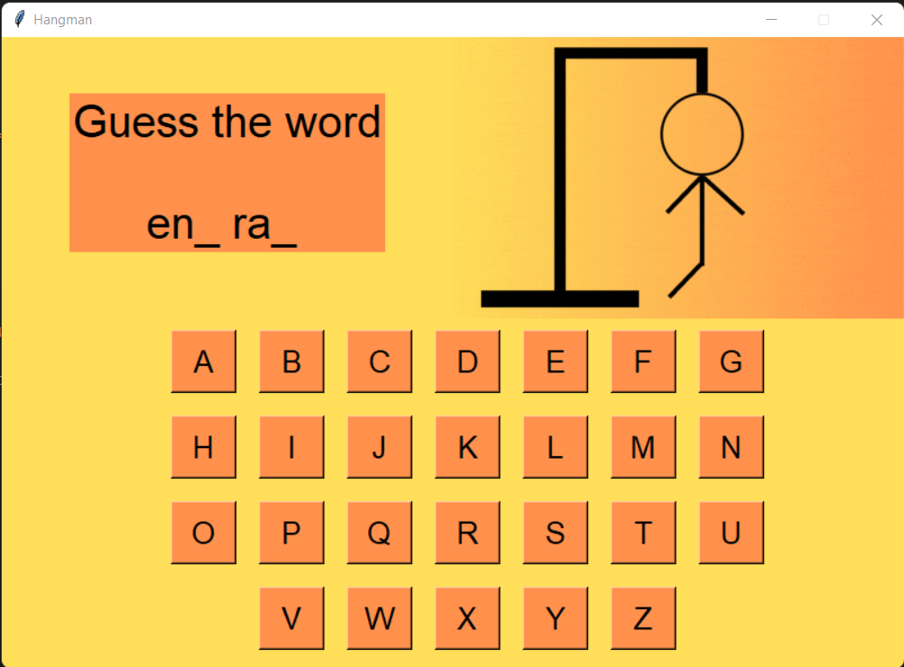
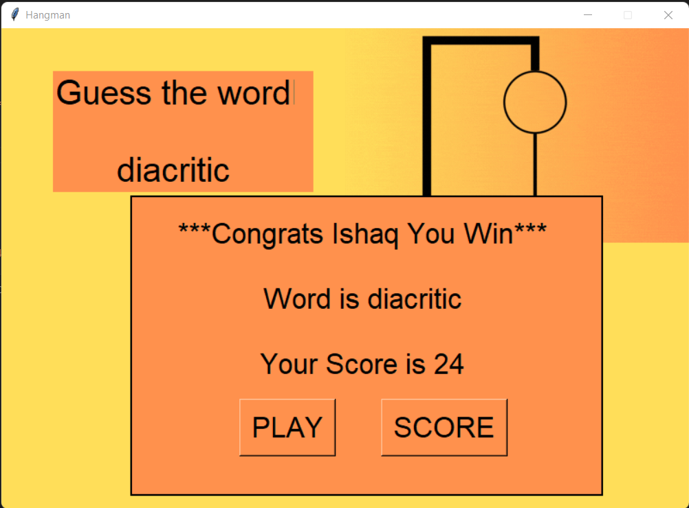
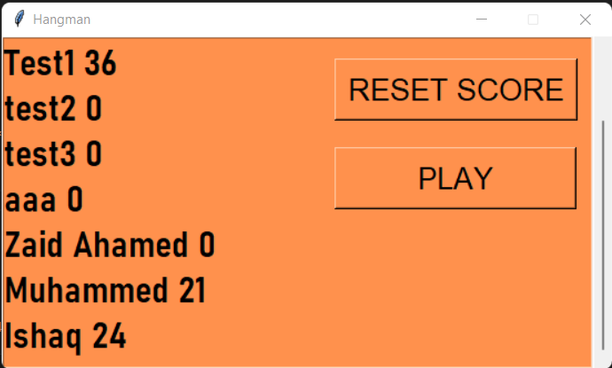

# Hangman Game 
 

* The Game is implement Using python. 
* Used Tkinter Module to build  Attractive User-Interface  and  Random  Module to get random word from file. 
* loops   and  functions  are  helped  to  efficiently  build  this  game. 
* Text files are used for store and retrive the words and player records.
   

   

### A  hangman  game  on  python  is  about  guessing  letters  (A-Z)  to  form  the  words. If  the  player  guesses  the correct  letter  that  is  within  the  word,  the  letter  appears  at  its  correct  position.
 

  

   

### The user  has to  guess  the correct  word  until  man hangs (6 tries), if then  the  game  is over. 
  

  

   

### Game Keeps track the score of the players who played the game before and it can be reseted when needed. 
  

   

## CHALLENGING PART WHILE WORKING ON THE PROJECT 
 

- Faced some errors While reading the scoreboard file while the scoreboard is empty. 
- Faced a problem While inserting an underscore with space `_ `. 
- Faced a problem While printing high scores if a player gets a high score. 
   

## ANY NEW THING LEARNT IN PYTHON WHILE WORKING ON THE PROJECT 
 

- Clearly understand Filing concepts and methods. 
- Clearly understand  about Functions and how to use it efficiently in code. 
- Learned about Python Modules like Tkinter, Random. 
- Learned to use Loops to improve efficiency in code. 
