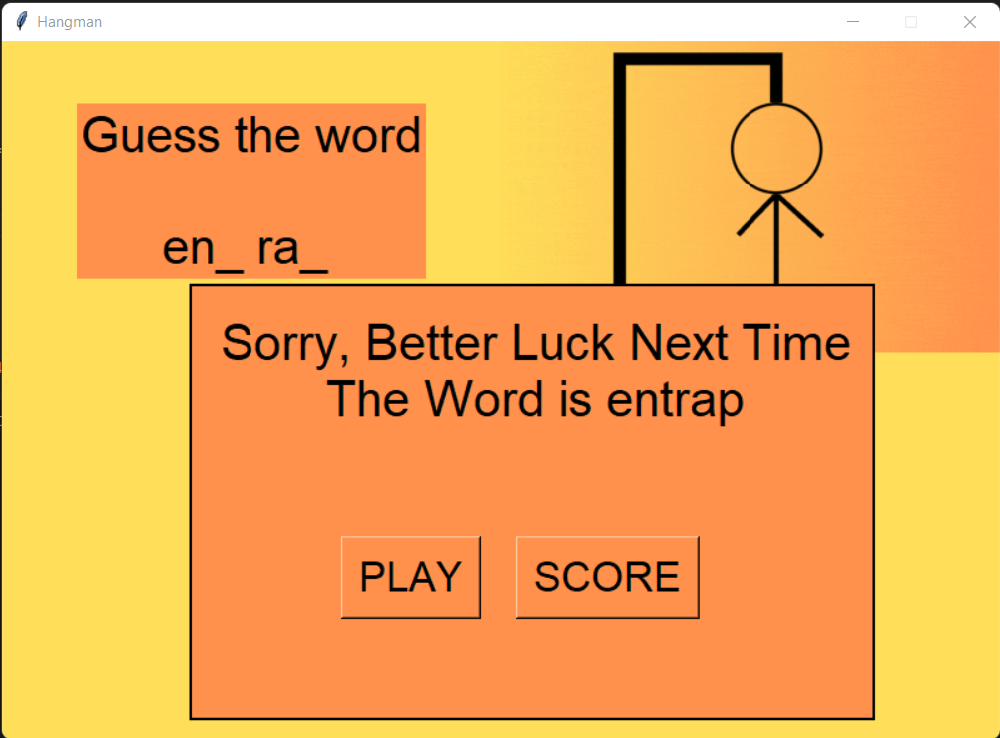

# Hangman Game

*The Game is implement Using python. 
*Used Tkinter Module to build  Attractive User-Interface  and  Random  Module to get random word from file. 
*loops   and  functions  are  helped  to  efficiently  build  this  game. 
*Text files are used for store and retrive the words and player records.

### A  hangman  game  on  python  is  about  guessing  letters  (A-Z)  to  form  the  words. If  the  player  guesses  the correct  letter  that  is  within  the  word,  the  letter  appears  at  its  correct  position.

### The user  has to  guess  the correct  word  until  man hangs (6 tries), if then  the  game  is over. 

### Game Keeps track the score of the players who played the game before and it can be reseted when needed. 

## CHALLENGING PART WHILE WORKING ON THE PROJECT 

-We faced some errors While reading the scoreboard file while the scoreboard is empty. 
-We faced a problem While inserting an underscore with space (‘_ ’). 
-We faced a problem While printing high scores if a player gets a high score. 
-We had issues when importing the xxxx.py files.

## ANY NEW THING LEARNT IN PYTHON WHILE WORKING ON THE PROJECT 

-We learned to tackle with filing concept and understood some methods of filing. 
-We learned about function and how we can use one function at many times. 
-We learned about modules like random. 
-We learned about how a while loop will work inside the function. 
-We learned about how we can manipulate many conditions inside the function like while loop. 

<!---->

